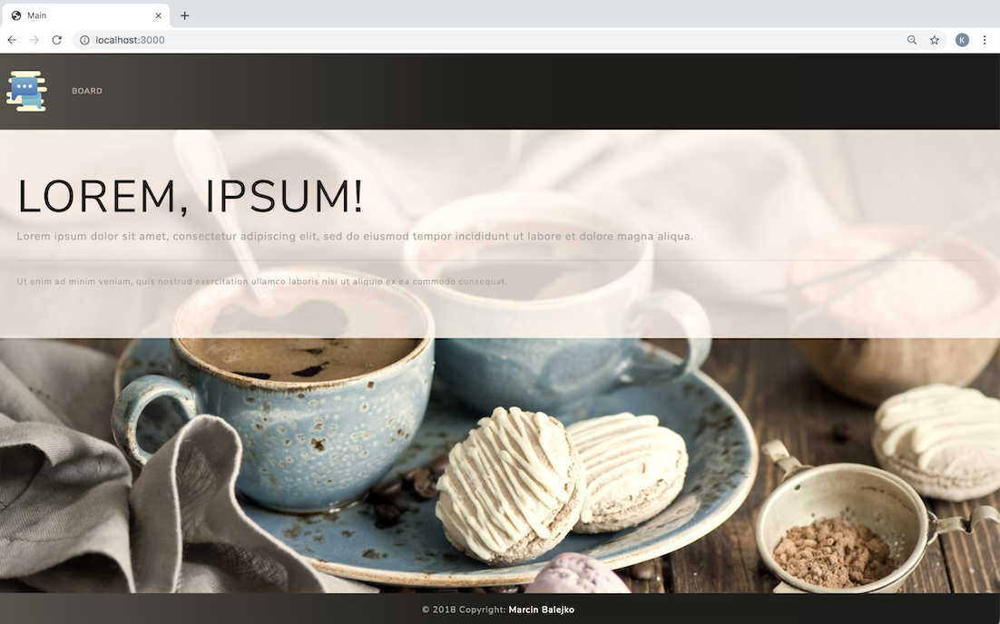
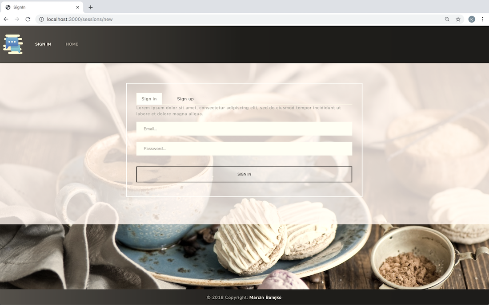
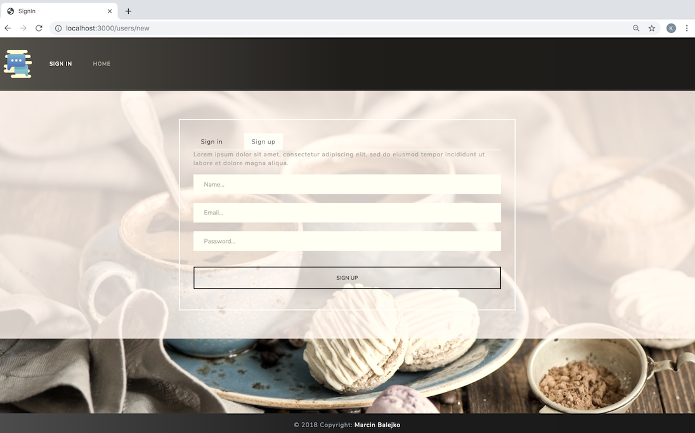
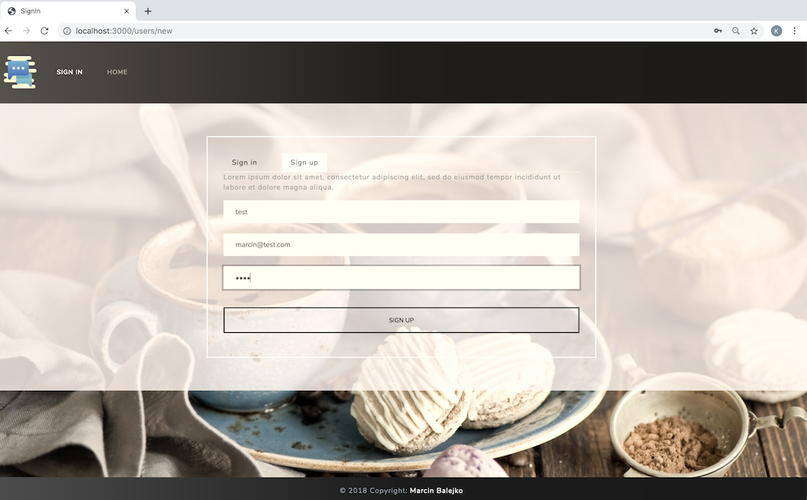
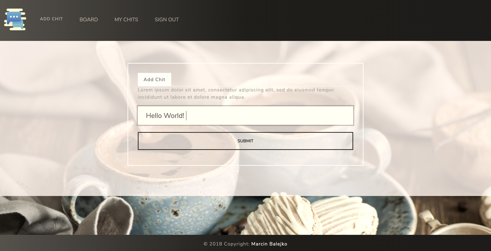
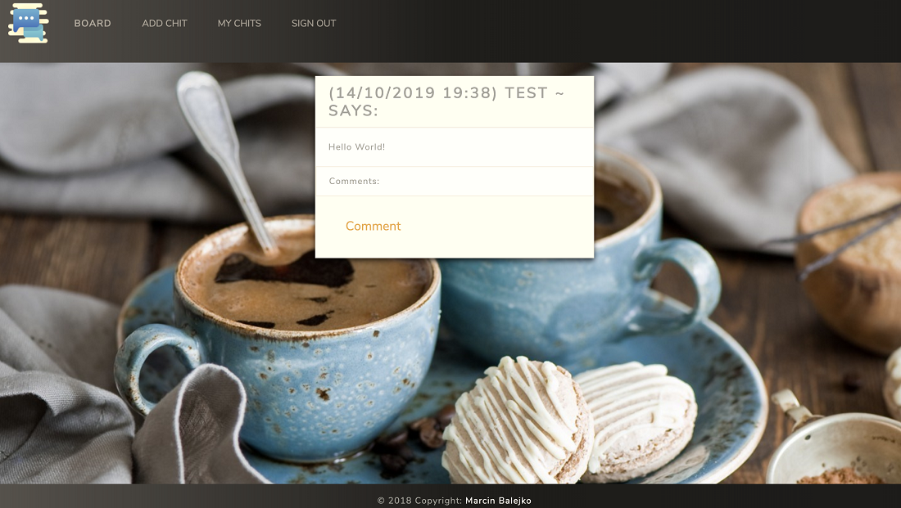
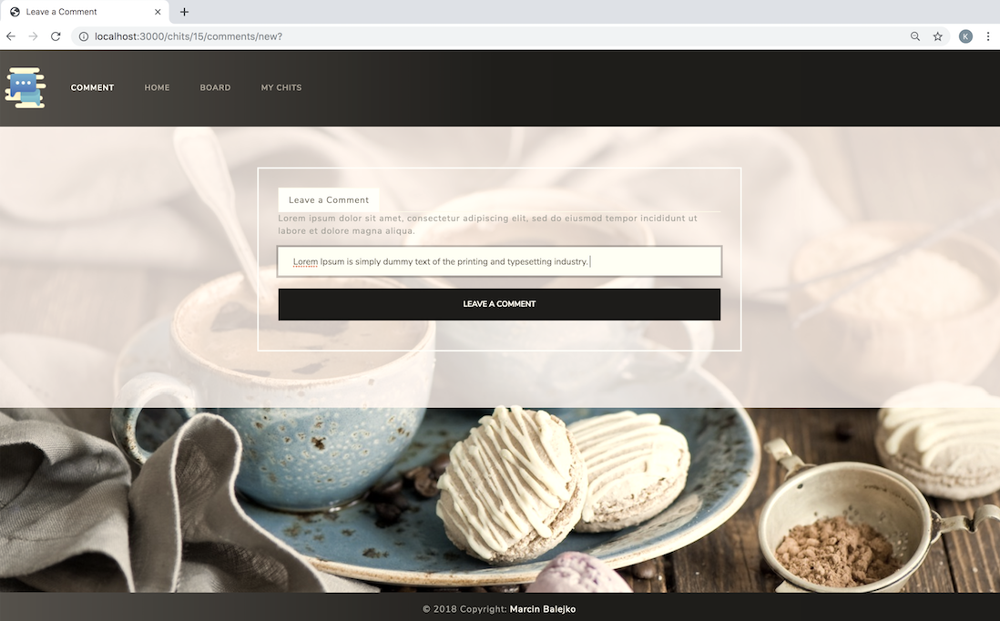
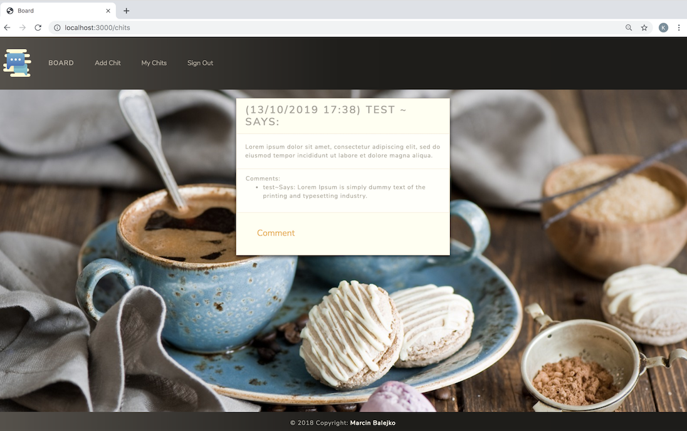
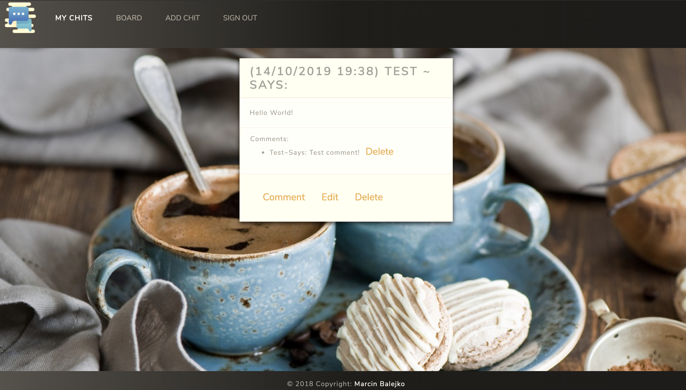
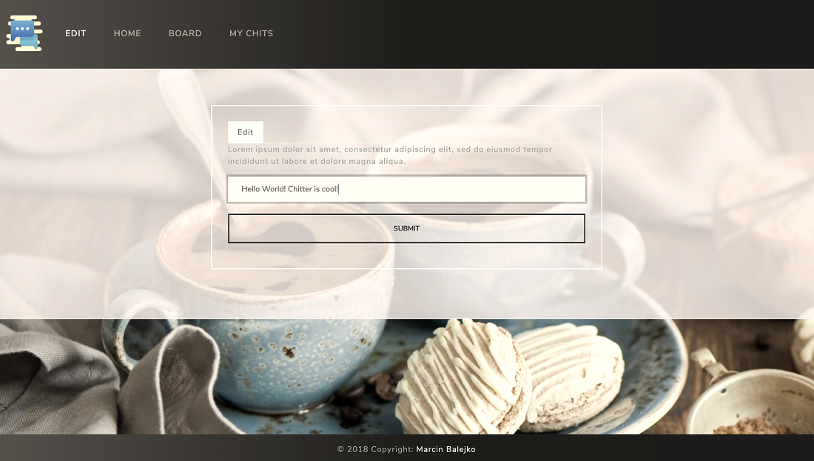

Chitter Challenge
=================

Building a small Twitter clone that will allow the users to post messages to a public stream.

Tools and technologies used:

* Ruby / Sinatra
* PostgreSQL
* RSpec / Capybara
* HTML / CSS
* Bootstrap

**Aiming for:**

* Complete TDD process ✔
* 100% test coverage ✔
* User interface which resembles original Twitter ✔

-----

|   Description    |   Image    |
|:------------:|:----------------:|
|Main Page| |
|User can sign in| |
|User can sign up| |
|Users can set their passwords| |
|User can add chits on the board| |
|Creating a chit| |
|User's chits appear on the board| |
|User's chits can be commented by their author and other users| |
|Comments appear in the comment section of each chit| |
|User can view, edit and delete his own chits and comments on 'My Chits' section | |
|Editing a chit| |

-----
